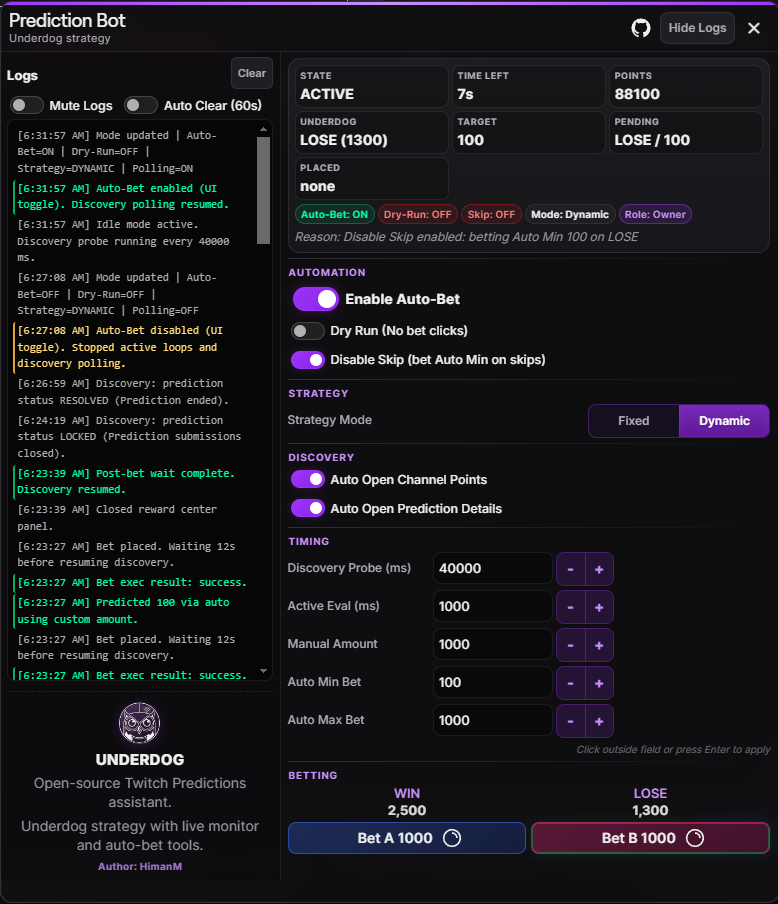

  
  <h1>Twitch Prediction Auto-Bet (Underdog)</h1>
  

    A modular Tampermonkey userscript that monitors Twitch Predictions,
    evaluates live underdog odds, and places bets near close with a configurable
    in-page control panel.
  

  

    
    
    
  

---

## What Is This?

This is a **browser userscript** that runs inside Twitch and automatically bets on Predictions using an **underdog strategy** — it always bets on the side with fewer points, maximizing potential return. The bot evaluates the live odds, calculates a bet size based on configurable tiers, and places the bet a few seconds before the prediction window closes.

Everything is controlled through a **Twitch-native dark panel** injected into the top navigation bar. No external apps, no API keys — just install the script and go.

### How It Works (Quick Summary)

1. **Discovers** active predictions by periodically opening the Channel Points popover
2. **Evaluates** the underdog (side with fewer points) and calculates a bet amount using ratio tiers
3. **Waits** until the prediction timer reaches ~7 seconds
4. **Places** the bet automatically using Twitch's own UI controls
5. **Returns** to idle discovery mode to catch the next prediction

---

## Installation

### One-Click Install

Direct install URL:

`https://raw.githubusercontent.com/HimanM/Twitch-Predictions-Bot/master/twitch-predictions.user.js`

Fallback raw URL:

`https://github.com/HimanM/Twitch-Predictions-Bot/blob/master/twitch-predictions.user.js?raw=1`

### Manual Install

1. Install [Tampermonkey](https://www.tampermonkey.net/) in your browser.
2. Create a new userscript.
3. Replace the template content with `twitch-predictions.user.js` from this repo.
4. Save and enable the script.
5. Navigate to any Twitch channel. You'll see the ✦ bot icon in the top navigation bar — click it to open the control panel.

> [!TIP]
> Start with **Dry Run** enabled first so you can confirm the script is reading prediction state correctly before allowing real bets.

> [!WARNING]
> Twitch can change its DOM at any time. If the UI stops responding after a Twitch update, check the in-panel logs for diagnostics before trusting automated placement.

> [!CAUTION]
> This script performs automated UI interaction on your Twitch account. Use conservative limits and only run it if you understand that risk. Channel Points have no cash value.
---

## Preview

---

### Open UI

*Above: Clicking the bot icon in the Twitch navigation bar opens the in-page control panel. All controls and status indicators are available directly inside Twitch, with no page reload required.*

## Control Panel Guide

When you click the bot icon in the top nav, a panel opens with all the controls. Here's what everything does:

### Status Dashboard (Top of Panel)

The status grid shows live information at a glance:

| Field | What It Shows |
| --- | --- |
| **State** | Current prediction status: `IDLE`, `ACTIVE`, `LOCKED`, or `RESOLVED` |
| **Time Left** | Countdown timer for the active prediction window |
| **Points** | Your available Channel Points balance |
| **Underdog** | Which outcome currently has fewer points (and its point total) |
| **Target** | The bet amount the bot plans to place, or `skip` if below minimum edge |
| **Pending** | The bot's current decision: which outcome and amount, or `skip` |
| **Placed** | After a bet is placed, shows which outcome and amount was used |

Below the grid are **status flags** showing current modes:

| Flag | Meaning |
| --- | --- |
| `Auto-Bet: ON/OFF` | Whether automation is active |
| `Dry-Run: ON/OFF` | Whether clicks are simulated |
| `Skip: ON/OFF` | Whether low-edge skip is enabled |
| `Mode: Fixed/Dynamic` | Active strategy mode |
| `Role: Owner/Observer` | Whether this tab owns the auto-bet lock |

The **Reason** line explains the bot's current decision (e.g. why it's skipping or what it's waiting for).

---

### Automation Section

| Control | Type | Default | What It Does |
| --- | --- | --- | --- |
| **Enable Auto-Bet** | Toggle Switch | On | Master on/off for all automation. When ON, the bot discovers predictions, evaluates odds, and places bets. When OFF, the bot only observes. Only one browser tab can own the auto-bet lock at a time. |
| **Dry Run** | Mini Toggle | Off | Simulates everything without actually clicking bet buttons. Use this to test the bot safely. Logs will show `Dry-run: would place X on outcome Y`. |
| **Disable Skip** | Mini Toggle | Off | When the strategy would normally skip a prediction (ratio too low), this forces a minimum bet of `Auto Min Bet` instead. Useful if you want to participate in every prediction. |

---

### Strategy Section

| Control | Type | Default | What It Does |
| --- | --- | --- | --- |
| **Strategy Mode** | Segment Buttons | Fixed | **Fixed**: uses hardcoded bet amounts per tier (500/400/300/200/100). **Dynamic**: scales bet amounts between your `Auto Min Bet` and `Auto Max Bet` based on the odds ratio. Use Dynamic if you want your min/max settings to control sizing. |

---

### Discovery Section

| Control | Type | Default | What It Does |
| --- | --- | --- | --- |
| **Auto Open Channel Points** | Mini Toggle | On | Automatically clicks the Channel Points button to check for active predictions during idle mode. If OFF, the bot only sees predictions if the popover is already open. |
| **Auto Open Prediction Details** | Mini Toggle | On | Automatically clicks into the prediction details view when an active prediction is found. This gives the bot access to detailed outcome data. |

---

### Timing Section

| Control | Type | Default | What It Does |
| --- | --- | --- | --- |
| **Discovery Probe (ms)** | Number Input + Stepper | 30000 | How often (in milliseconds) the bot checks for new predictions while idle. Lower = faster detection but more clicks. Range: 5,000–300,000. |
| **Active Eval (ms)** | Number Input + Stepper | 1000 | How often the bot re-evaluates odds during an active prediction. Lower = more responsive to changing odds. Range: 1,000–60,000. |
| **Manual Amount** | Number Input + Stepper | 100 | The fixed amount used by the **Bet A** / **Bet B** manual buttons at the bottom. This does NOT affect auto-bet sizing. |
| **Auto Min Bet** | Number Input + Stepper | 100 | Minimum bet amount for auto-bet. If the strategy calculates a bet below this, it will skip (unless Disable Skip is on). In Dynamic mode, this sets the lower bound of the scaling range. |
| **Auto Max Bet** | Number Input + Stepper | 1000 | Maximum bet amount for auto-bet. The bot will never auto-bet more than this. In Dynamic mode, this sets the upper bound of the scaling range. |

> [!NOTE]
> Use the **−** and **+** stepper buttons next to each input to adjust values quickly, or type directly into the field.

---

### Betting Section

| Element | What It Does |
| --- | --- |
| **Prediction Card** | Shows the two outcomes and their current point totals |
| **Outcome Labels** | Displays the names of Outcome A and B |
| **Bet A / Bet B Buttons** | Manual bet buttons — click to immediately bet the **Manual Amount** on that outcome. These work independently of auto-bet. Blue = Outcome A, Pink = Outcome B. |

Button visual states:
- **Green border glow** — The bot has a pending decision to bet on this outcome
- **Blue border glow** — The bot has already placed a bet on this outcome

---

### Logs Pane (Left Side)

The logs pane shows a scrollable history of what the bot is doing:

| Control | What It Does |
| --- | --- |
| **Hide Logs / Show Logs** | Header button that toggles the entire logs pane visible/hidden. Hiding it makes the panel narrower. |
| **Clear** | Wipes all current log entries |
| **Mute Logs** | Mini toggle — when ON, stops recording new log entries entirely. Useful to reduce memory usage during long sessions. |
| **Auto Clear (60s)** | Mini toggle — when ON, automatically wipes the log buffer every 60 seconds. Good for overnight/unattended use. |

#### Log Colors

Logs are color-coded by severity:

| Color | Level | Examples |
| --- | --- | --- |
| 🟢 Green | **Success** | Bot enabled, bet placed, script initialized |
| 🟡 Yellow | **Warning** | Bet skipped, dry-run action, fallback used, lock lost |
| 🔴 Red | **Error** | Bet failed, controls unavailable, lock blocked |
| ⚪ Gray | **Info** | Settings changed, UI opened, status updates |

> [!NOTE]
> Logs are **UI-only** — nothing is printed to the browser console. The log buffer holds a maximum of 80 entries.

---

## Strategy and Bet Sizing

### 1. Pick Underdog

The side with fewer pooled points is treated as the underdog.

`ratio = favoritePoints / underdogPoints`

### 2. Strategy Mode

Use the **Strategy Mode** toggle in the panel:

- **Fixed**: uses the tier bet values from config (`500/400/300/200/100`).
- **Dynamic**: computes tier base between your current `Auto Min Bet` and `Auto Max Bet`.

### 3. Tier Bands

The ratio tiers decide whether to bet or skip:

| Ratio (favorite : underdog) | Tier |
| --- | --- |
| 100:1+ | Strongest edge |
| 20:1+ | High edge |
| 10:1+ | Medium edge |
| 5:1+ | Low edge |
| 2:1+ | Minimum edge |
| <2:1 | Skip |

### 4. Base Amount Per Mode

**Fixed mode** uses static tier values:

| Ratio (favorite : underdog) | Base Amount |
| --- | ---: |
| 100:1+ | 500 |
| 20:1+ | 400 |
| 10:1+ | 300 |
| 5:1+ | 200 |
| 2:1+ | 100 |

**Dynamic mode** uses your own min/max settings:

`tierBase = scaleLog(ratio, minRatio=2, maxRatio=100, autoMinBet, autoMaxBet)`

That means changing `Auto Min Bet` and `Auto Max Bet` directly changes what each ratio tier pays in Dynamic mode.

### 5. Apply Bounds and Safety

`amount = min(tierBase, autoMaxBet, availablePoints, floor(availablePoints * 0.5))`

If `amount < autoMinBet`, the strategy returns skip.

When **Disable Skip** is enabled, skip decisions are converted to a forced min-sized bet (subject to max and wallet caps).

### Worked Example

If your settings are:

- `Auto Min Bet = 1`
- `Auto Max Bet = 1000`
- `Available Points = 800`
- `Strategy Mode = Dynamic`

And the live pool is:

- `Outcome A = 10000`
- `Outcome B = 10`

Then the bot evaluates:

1. `B` is the underdog because `10 < 10000`.
2. `ratio = 10000 / 10 = 1000`, so it hits the top tier.
3. Dynamic base becomes approximately `1000` (your current max).
4. The final bet becomes `min(1000, 1000, 800, floor(800 * 0.5))`.
5. `floor(800 * 0.5) = 400`, so the final amount is `400`.

Result: the bot bets `400` on `B`. Even with a high dynamic base, the 50% wallet cap is stricter.

> [!IMPORTANT]
> `Auto Max Bet` is only a ceiling. It does not force the bot to spend that amount, in either mode.

---

## Skip Scenarios

The bot may skip a prediction instead of betting. The table below lists every skip scenario, whether it can be bypassed by the **Disable Skip** toggle, and why.

| # | Scenario | Skippable by Disable Skip? | Reason |
| --- | --- | :---: | --- |
| 1 | **Region blocked / 0 available points** | ❌ | You physically cannot place a bet. |
| 2 | **Prediction not ACTIVE** (locked, resolved, canceled) | ❌ | Betting window is closed. |
| 3 | **Both outcomes have 0 points** | ❌ | No signal at all — nothing to evaluate. |
| 4 | **One outcome has 0 points** | ❌ (always bets) | The bot automatically bets `Auto Min Bet` on the 0-point side for max payout. This is not a skip. |
| 5 | **Near 50/50** (ratio < 2:1, no tier matches) | ✅ | Payout too low to justify the risk. Disable Skip forces a min bet instead. |
| 6 | **Computed bet below Auto Min Bet** (after caps) | ✅ | Safety floor. Disable Skip forces a min bet instead. |
| 7 | **Computed bet ≤ 0** (edge case after all caps) | ❌ | Cannot place a 0-point bet. |

> [!NOTE]
> **Disable Skip** converts skips #5 and #6 into a forced `Auto Min Bet` on the underdog side (still subject to the 50% wallet cap and `Auto Max Bet`).

---

## Runtime Flow

1. Startup initializes UI, observer, and auto-bet lock.
2. Idle mode runs a discovery probe at the configured interval.
3. On active prediction:
   - Active eval loop updates `pendingDecision`.
   - Watch loop tracks timer and fires near trigger (`<= 7s`).
4. Placement sequence:
   - Prefers custom mode toggle + per-outcome input + Vote button.
   - If custom controls are missing, falls back to clicking the quick outcome button.
5. Loops clear and return to discovery mode.

---

## Multi-Tab Lock

Only **one browser tab** can run auto-bet at a time. When you enable Auto-Bet, the tab claims a lock via `localStorage`. If another tab already owns the lock, the new tab becomes an **Observer** and auto-bet is blocked. If the owning tab closes or goes stale, the lock expires and other tabs can claim it.

---

## All Settings Reference

| Setting | Key | Default | Persisted | Range/Values |
| --- | --- | --- | --- | --- |
| Enable Auto-Bet | `enabled` | `true` | ✅ | on/off |
| Dry Run | `dryRun` | `false` | ✅ | on/off |
| Disable Skip | `forceMinOnSkip` | `false` | ✅ | on/off |
| Strategy Mode | `strategyMode` | `fixed` | ✅ | `fixed` / `dynamic` |
| Auto Open Channel Points | `autoOpenPopover` | `true` | ✅ | on/off |
| Auto Open Prediction Details | `autoOpenDetails` | `true` | ✅ | on/off |
| Discovery Probe (ms) | `discoveryIntervalMs` | `40000` | ✅ | 5000–300000 |
| Active Eval (ms) | `evalIntervalMs` | `1000` | ✅ | 1000–60000 |
| Manual Amount | `manualAmount` | `100` | ✅ | ≥ 1 |
| Auto Min Bet | `autoMinBet` | `1` | ✅ | ≥ 1 |
| Auto Max Bet | `autoMaxBet` | `1000` | ✅ | 1–1000000 |
| Show Logs Pane | `logsVisible` | `true` | ✅ | on/off |
| Panel Open | `panelOpen` | `false` | ✅ | on/off |
| Mute Logs | `logsDisabled` | `false` | ✅ | on/off |
| Auto Clear Logs | `autoClearLogs` | `false` | ✅ | on/off |

All settings are stored in `localStorage` under the key `tpred.settings.v1`.

---

## Module Layout

Main file:

- `twitch-predictions.user.js` — bootstrap header + `@require` list + init

Modules loaded in order:

1. `modules/config.js` — constants, runtime state, settings persistence
2. `modules/utils.js` — text parsing, HTML escaping, timing helpers
3. `modules/dom.js` — Twitch DOM reading, state detection, UI helpers
4. `modules/strategy.js` — underdog evaluation and bet sizing logic
5. `modules/bettor.js` — UI interaction: clicking buttons, entering amounts
6. `modules/ui.js` — injected panel: styles, HTML structure, event wiring, render loop
7. `modules/runner.js` — logging, polling loops, MutationObserver, initialization

---

## Repository Files

| File | Description |
| --- | --- |
| `twitch-predictions.user.js` | Installable userscript bootstrap |
| `modules/` | Runtime modules (`config`, `utils`, `dom`, `strategy`, `bettor`, `ui`, `runner`) |
| `algorithm.js` | Standalone strategy helper and tests |
| `plan.md` | Planning and implementation notes |
| `pics/` | UI screenshots and icon assets |

---

## Known Limitations

- Twitch DOM can change without notice, which may break selectors.
- Custom controls are preferred, but Twitch can still render alternate layouts.
- All reads and actions are DOM-driven; no direct API integration.
- Only one tab can run auto-bet at a time (multi-tab lock).

---

## Legal Notice

This project is unofficial and not affiliated with Twitch Interactive, Inc.
Use at your own risk. Channel Points have no cash value.
Automated UI interaction may be subject to Twitch terms.
